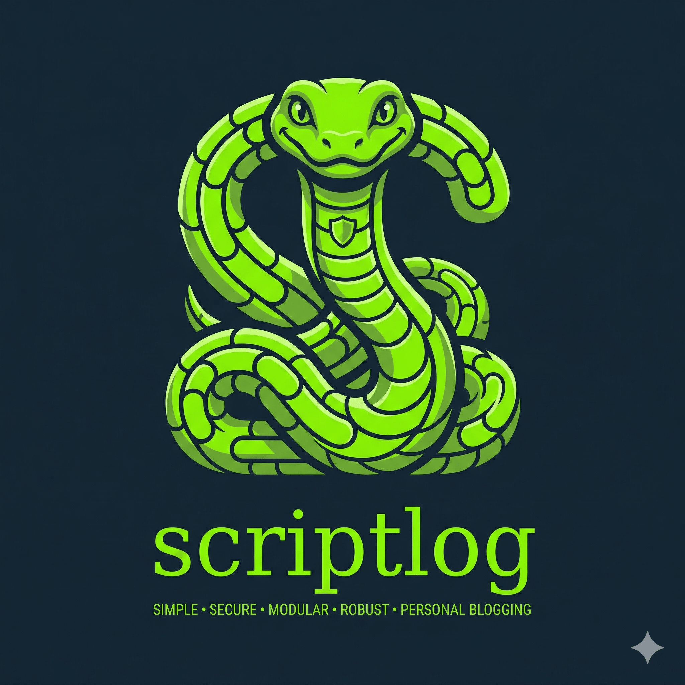

# Scriptlog

**Empowering Your Personal Weblog**

[](LICENSE.md)
[](https://www.php.net/)
[](https://www.mysql.com/)
[](https://mariadb.org/)
[](https://www.php-fig.org/psr/psr-12/)
[](https://github.com/cakmoel/Scriptlog/actions/workflows/tests.yml)


---

Scriptlog is a simple, secure, modular, and robust personal blogging platform. It is a refactored fork of Piluscart 1.4.1, engineered to emphasize simplicity, privacy, and security without the overhead of a complex Content Management System.

## Project Overview

Scriptlog is not designed to replace full-scale CMS frameworks. Instead, it is meticulously engineered to:
- Power personal weblogs that do not require a heavy CMS.
- Provide a secure foundation for blogging with modern security practices.
- Run fast with minimal overhead.

### Core Technologies
- **Backend:** PHP 7.4+ (PSR-12 compliant)
- **Database:** MySQL 5.7+ / MariaDB 10.3+
- **Architecture:** Multi-layered MVC-like (`Request` → `Bootstrap` → `Dispatcher` → `Controller` → `Service` → `DAO` → `Database`)
- **Security:** Laminas (Escaper, Crypt), Defuse PHP Encryption, voku Anti-XSS, HTMLPurifier.

## Requirements

Ensure your hosting environment meets the following requirements:
- **PHP:** 7.4+ (with extensions: `pdo`, `pdo_mysql`, `json`, `mbstring`, `curl`)
- **Web Server:** Apache (with `mod_rewrite` enabled) or Nginx
- **Database:** MySQL 5.7+ or MariaDB 10.3+
- **Composer:** Latest (for dependency management)

## Installation

1. **Clone the Repository**
   ```bash
   git clone https://github.com/ScriptLog/scriptlog.git
   cd scriptlog
   ```

2. **Install Dependencies**
   ```bash
   composer install
   ```

3. **Set Permissions**
   ```bash
   chmod -R 755 public/
   chmod -R 777 public/cache/ public/log/
   ```

4. **Database Setup**
   Create a new empty database (use `utf8mb4_general_ci` collation).

5. **Run the Installer**
   Navigate to `/install/` in your web browser and follow the wizard:
   - Step 1: System Requirements Check (`install/index.php`)
   - Step 2: Database Setup (`install/setup-db.php`) - creates 21 tables
   - Step 3: Complete Setup (`install/finish.php`)

6. **Cleanup (Critical)**
   For security purposes, **delete the `install/` directory** immediately after installation is complete.

### Configuration Files

After installation, two configuration files are generated:

| File | Purpose |
|------|---------|
| `config.php` | Main configuration with `$_ENV` fallbacks |
| `.env` | Environment variables (auto-generated) |
| `lib/utility/.lts/lts.txt` | Defuse encryption key for authentication cookies |

## Configuration

Scriptlog supports both `.env` and `config.php` files for configuration. During installation, both files are automatically generated and kept in sync.

### config.php Structure

```php
<?php
return [
    'db' => [
        'host' => $_ENV['DB_HOST'] ?? 'localhost',
        'user' => $_ENV['DB_USER'] ?? '',
        'pass' => $_ENV['DB_PASS'] ?? '',
        'name' => $_ENV['DB_NAME'] ?? '',
        'port' => $_ENV['DB_PORT'] ?? '3306',
        'prefix' => $_ENV['DB_PREFIX'] ?? ''
    ],
    'app' => [
        'url'   => $_ENV['APP_URL'] ?? 'http://example.com',
        'email' => $_ENV['APP_EMAIL'] ?? '',
        'key'   => $_ENV['APP_KEY'] ?? '',
        'defuse_key' => 'lib/utility/.lts/lts.txt'
    ],
    'mail' => [
        'smtp' => [
            'host' => $_ENV['SMTP_HOST'] ?? '',
            'port' => $_ENV['SMTP_PORT'] ?? 587,
            'encryption' => $_ENV['SMTP_ENCRYPTION'] ?? 'tls',
            'username' => $_ENV['SMTP_USER'] ?? '',
            'password' => $_ENV['SMTP_PASS'] ?? '',
        ],
        'from' => [
            'email' => $_ENV['MAIL_FROM_ADDRESS'] ?? '',
            'name' => $_ENV['MAIL_FROM_NAME'] ?? 'Blogware'
        ]
    ],
];
```

## Running the Application

| Environment | URL |
|-------------|-----|
| **Public Site** | `http://your-domain/` |
| **Admin Panel** | `http://your-domain/admin/` |
| **API Endpoint** | `http://your-domain/api/v1/` |

## Directory Structure

```
ScriptLog/
|-- index.php                    # Public front controller
|-- config.php                   # Application configuration
|-- .env                         # Environment variables
|
|-- admin/                      # Admin panel
|   |-- index.php               # Admin entry point
|   |-- login.php               # Login page
|   +-- ...                     # Other admin pages
|
|-- api/                        # RESTful API
|   +-- index.php               # API entry point
|
|-- lib/                       # Core library
|   |-- main.php               # Application bootstrap
|   |-- common.php             # Constants and functions
|   +-- core/                  # Core classes (Bootstrap, Dispatcher, DbFactory, etc.)
|       +-- dao/               # Data Access Objects
|       +-- service/           # Business logic layer
|       +-- controller/        # Request controllers
|       +-- model/             # Data models
|       +-- utility/           # Utility functions (100+ files)
|       +-- vendor/           # Composer dependencies
|
|-- public/                    # Web root
|   +-- themes/              # Theme templates
|       +-- blog/            # Default theme
|   +-- files/               # User uploads (pictures, audio, video, docs)
|   +-- cache/               # Cache directory
|   +-- log/                 # Log directory
|
|-- install/                  # Installation wizard
|   +-- include/             # Installation includes
|
|-- docs/                    # Developer guides
    +-- DEVELOPER_GUIDE.md
    +-- TESTING_GUIDE.md
    +-- PLUGIN_DEVELOPER_GUIDE.md
    +-- API_DOCUMENTATION.md
    +-- API_OPENAPI.yaml
    +-- API_OPENAPI.json
|
+-- tests/                  # PHPUnit test suite
```

For detailed architecture and component documentation, see [DEVELOPER_GUIDE.md](src/docs/DEVELOPER_GUIDE.md).

## Development

Scriptlog adheres to **PSR-12** coding standards and uses **Conventional Commits**.

### Architecture

Scriptlog uses a **multi-layer architecture** designed for maintainability and scalability:

```
Request → Front Controller → Bootstrap → Dispatcher → Controller → Service → DAO → Database
```

| Step | Component | Location |
|------|-----------|----------|
| 1 | **Front Controller** | `index.php` |
| 2 | **Bootstrap** | `lib/core/Bootstrap.php` |
| 3 | **Dispatcher** | `lib/core/Dispatcher.php` |
| 4 | **Controller** | `lib/controller/*` |
| 5 | **Service** | `lib/service/*` |
| 6 | **DAO** | `lib/dao/*` |
| 7 | **View** | `lib/core/View.php` |

### Adding New Features

When adding features, follow the layered implementation pattern:
1. **Database Table:** Add to `install/include/dbtable.php`
2. **DAO:** Create in `lib/dao/` (Database interactions)
3. **Service:** Create in `lib/service/` (Business logic)
4. **Controller:** Create in `lib/controller/` (Request handling)
5. **Routes:** Add to `lib/core/Bootstrap.php`

> **WARNING:** Never bypass the DAO layer when accessing the database. Always use prepared statements to prevent SQL injection.

### Key Commands
- **Run Tests:** `vendor/bin/phpunit`
- **Static Analysis:** `vendor/bin/phpstan` (see [TESTING_GUIDE.md](src/docs/TESTING_GUIDE.md))

## Security Features

- **Authentication:** Custom secure session handler (`SessionMaker`) with remember-me tokens and session fingerprinting.
- **CSRF:** Protected via `csrf_defender` and form security utilities.
- **XSS:** Multi-layered prevention using `Anti-XSS` (voku) and `HTMLPurifier`.
- **Encryption:** Sensitive data encrypted using `defuse/php-encryption` with auto-generated keys.
- **Password Hashing:** Uses PHP's built-in `password_hash()` with bcrypt.
- **Access Control:** Role-based user levels with granular permissions.

### User Levels

| Level | Permissions |
|-------|-------------|
| **administrator** | Full access - PRIVACY, USERS, IMPORT, PLUGINS, THEMES, CONFIGURATION, PAGES, NAVIGATION, TOPICS, COMMENTS, MEDIALIB, REPLY, POSTS, DASHBOARD |
| **manager** | PLUGINS, THEMES, CONFIGURATION, PAGES, NAVIGATION, TOPICS, COMMENTS, MEDIALIB, REPLY, POSTS, DASHBOARD |
| **editor** | TOPICS, COMMENTS, MEDIALIB, REPLY, POSTS, DASHBOARD |
| **author** | COMMENTS, MEDIALIB, REPLY, POSTS, DASHBOARD |
| **contributor** | POSTS, DASHBOARD |
| **subscriber** | DASHBOARD only |

## Contributing

Contributions are welcome! Please read our [Contributing Guidelines](CONTRIBUTING.md) before submitting pull requests.

## Code of Conduct

Please read our [Code of Conduct](CODE_OF_CONDUCT.md) to keep our community approachable and respectable.

## Security

For security vulnerabilities, please read our [Security Policy](SECURITY.md) for responsible disclosure guidelines.

## License

Scriptlog is Open Source and Free PHP Blog Software licensed under the [MIT License](LICENSE.md).

---

*Thank you for creating with Scriptlog.*