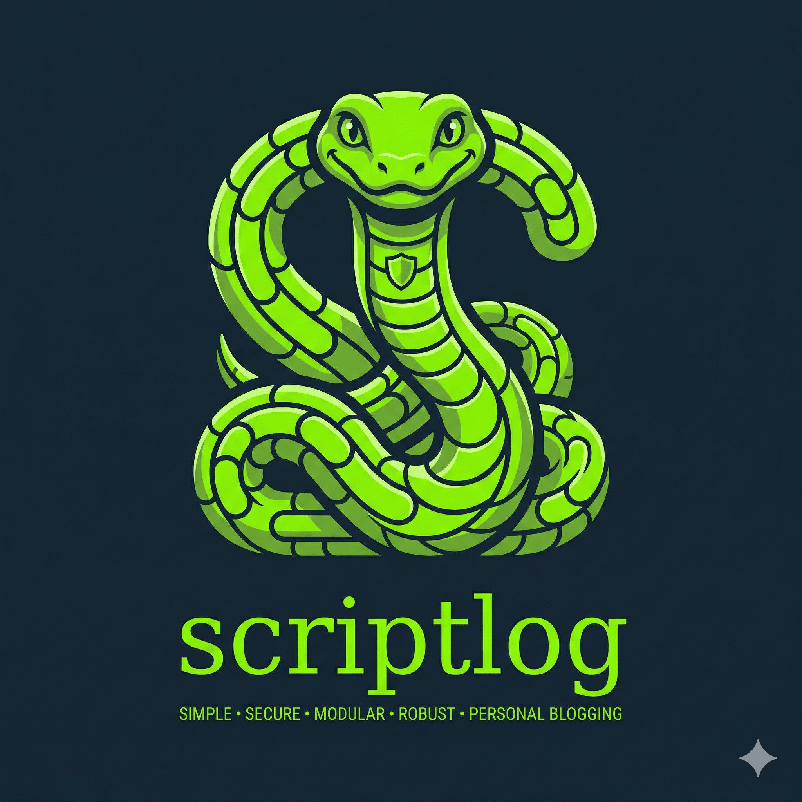

# Scriptlog

**Empowering Your Personal Weblog**

[](LICENSE.md)
[](https://www.php.net/)
[](https://www.mysql.com/)
[](https://mariadb.org/)
[](https://www.php-fig.org/psr/psr-12/)
[](https://github.com/cakmoel/Scriptlog/actions/workflows/tests.yml)


---

Scriptlog is a free and open-source PHP blog software designed to be simple, private, and secure. It powers personal weblogs without the overhead of a full-scale Content Management System - a fast, minimal, and modular foundation for sharing your stories and thoughts.

## Project Overview

Scriptlog is not designed to replace full-scale CMS frameworks. Instead, it is meticulously engineered to:
- Power personal weblogs that do not require a heavy CMS.
- Provide a secure foundation for blogging with modern security practices.
- Run fast with minimal overhead.

### Core Technologies
- **Backend:** PHP 7.4 - 8.5 (PSR-12 compliant)
- **Database:** MySQL 5.7+ / MariaDB 10.3+
- **Architecture:** Multi-layered MVC-like (`Request` -> `Bootstrap` -> `Dispatcher` -> `Controller` -> `Service` -> `DAO` -> `Database`)
- **Security:** Laminas (Escaper, Crypt), Defuse PHP Encryption, voku Anti-XSS, HTMLPurifier.

## Requirements

Ensure your hosting environment meets the following requirements:
- **PHP:** 7.4 - 8.5 (with extensions: `pdo`, `pdo_mysql`, `json`, `mbstring`, `curl`, `gd`, `fileinfo`, `openssl`)
- **Web Server:** Apache (with `mod_rewrite` enabled) or Nginx
- **Database:** MySQL 5.7+ or MariaDB 10.3+
- **Composer:** Latest (for dependency management)

## Installation

The application lives in the `src/` directory, which is also your web root. All commands below run from the repository root.

1. **Clone the Repository**
   ```bash
   git clone https://github.com/cakmoel/Scriptlog.git
   cd Scriptlog
   ```

2. **Install Dependencies**
   ```bash
   composer install
   ```
   > **Note:** Composer's `platform.php` config locks dependency resolution to PHP 7.4, ensuring all packages stay compatible across PHP 7.4 through 8.5. No runtime warnings occur on newer PHP versions.

3. **Set Permissions**
   ```bash
   # Directories: readable and executable, Files: readable only
   find src/public -type d -exec chmod 755 {} \;
   find src/public -type f -exec chmod 644 {} \;

   # Writable directories (web server needs write access)
   chmod -R 775 src/public/cache src/public/log

   # Writable uploads - directories only, files stay non-executable
   find src/public/files -type d -exec chmod 775 {} \;
   find src/public/files -type f -exec chmod 644 {} \;

   # Restrict access to configuration files
   chmod 640 src/config.php src/.env
   ```
   > **Note:** Adjust ownership if needed - the web server user (e.g., `www-data`) must own or be in the group of `src/public/cache`, `src/public/log`, and `src/public/files`.

4. **Database Setup**
   Create a new empty database (use `utf8mb4_general_ci` collation).

5. **Run the Installer**
   Navigate to `/install/` in your web browser and follow the wizard:
   - Step 1: System Requirements Check (`install/index.php`)
   - Step 2: Database Setup (`install/setup-db.php`) - creates 22 tables
   - Step 3: Complete Setup (`install/finish.php`)

6. **Cleanup (Critical)**
   For security purposes, **delete the `src/install/` directory** immediately after installation is complete.

### Configuration Files

After installation, two configuration files are generated in `src/`:

| File | Purpose |
|------|---------|
| `src/config.php` | Main configuration with `$_ENV` fallbacks |
| `src/.env` | Environment variables (auto-generated) |
| `storage/keys/[random_filename].php` | Defuse encryption key for authentication cookies (kept outside the web root) |

## Configuration

Scriptlog supports both `.env` and `config.php` files for configuration. During installation, both files are automatically generated in the `src/` directory and kept in sync.

### config.php Structure

```php
<?php
return [
    'db' => [
        'host' => $_ENV['DB_HOST'] ?? 'localhost',
        'user' => $_ENV['DB_USER'] ?? '',
        'pass' => $_ENV['DB_PASS'] ?? '',
        'name' => $_ENV['DB_NAME'] ?? '',
        'port' => $_ENV['DB_PORT'] ?? '3306',
        'prefix' => $_ENV['DB_PREFIX'] ?? ''
    ],
    'app' => [
        'url'   => $_ENV['APP_URL'] ?? 'https://your-domain.com',
        'email' => $_ENV['APP_EMAIL'] ?? '',
        'key'   => $_ENV['APP_KEY'] ?? '',
        'defuse_key' => $_ENV['DEFUSE_KEY_PATH'] ?? 'storage/keys/[random].php'
    ],
    'mail' => [
        'smtp' => [
            'host' => $_ENV['SMTP_HOST'] ?? '',
            'port' => $_ENV['SMTP_PORT'] ?? 587,
            'encryption' => $_ENV['SMTP_ENCRYPTION'] ?? 'tls',
            'username' => $_ENV['SMTP_USER'] ?? '',
            'password' => $_ENV['SMTP_PASS'] ?? '',
        ],
        'from' => [
            'email' => $_ENV['MAIL_FROM_ADDRESS'] ?? '',
            'name' => $_ENV['MAIL_FROM_NAME'] ?? 'Blogware'
        ]
    ],
    'os' => [
        'system_software' => $_ENV['SYSTEM_OS'] ?? 'Linux',
        'distrib_name'    => $_ENV['DISTRIB_NAME'] ?? 'Linux'
    ],
    'api' => [
        'allowed_origins' => $_ENV['CORS_ALLOWED_ORIGINS'] ?? 'https://your-domain.com'
    ],
];
```

## Running the Application

The web root is the `src/` directory:

| Environment | URL |
|-------------|-----|
| **Public Site** | `http://your-domain/` |
| **Admin Panel** | `http://your-domain/admin/` |
| **API Endpoint** | `http://your-domain/api/v1/` |

## Directory Structure

```
Scriptlog/
|-- assets/                    # Repository assets (mascot, graphics)
|-- src/                       # Application root (your web root)
|   |-- index.php              # Public front controller
|   |-- config.php             # Main configuration (generated by the installer)
|   |-- .env                   # Environment variables (generated by the installer)
|   |
|   |-- admin/                 # Administration panel (admin/index.php)
|   |   |-- dashboard.php      # Dashboard
|   |   |-- posts.php          # Post management
|   |   |-- pages.php          # Page management
|   |   |-- users.php          # User management
|   |   |-- option-*.php       # Settings pages (general, mail, permalink, ...)
|   |   +-- ...                # Other admin pages, UI assets, WYSIWYG editor
|   |
|   |-- api/                   # RESTful API (api/index.php, versioned at /api/v1/)
|   |
|   |-- install/               # Installer wizard (DELETE after installation)
|   |   +-- include/           # Installer helpers (dbtable.php, check-engine.php, ...)
|   |
|   |-- lib/                   # Core library
|   |   |-- main.php           # Application bootstrap loader
|   |   |-- common.php         # Constants and shared functions
|   |   |-- controller/        # Request controllers
|   |   |-- core/              # Core classes (Bootstrap, Dispatcher, DbFactory, View, ...)
|   |   |-- dao/               # Data Access Objects
|   |   |-- dto/               # Data transfer objects
|   |   |-- handler/           # Request and action handlers
|   |   |-- model/             # Data models
|   |   |-- service/           # Business logic layer
|   |   |-- utility/           # Helper functions (200+ files)
|   |   |-- validator/         # Input validation
|   |   +-- vendor/            # Composer dependencies
|   |
|   |-- public/                # Public assets and generated files
|   |   |-- themes/            # Theme templates (blog = default theme)
|   |   |-- files/             # User uploads (pictures, audio, video, docs)
|   |   |-- cache/             # Runtime cache
|   |   +-- log/               # Log files
|   |
|   |-- docs/                  # Developer and user documentation
|   |   |-- DEVELOPER_GUIDE.md
|   |   |-- TESTING_GUIDE.md
|   |   |-- THEME_DEVELOPER_GUIDE.md
|   |   |-- PLUGIN_DEVELOPER_GUIDE.md
|   |   |-- API_DOCUMENTATION.md
|   |   |-- DATABASE_SCHEMA_GUIDE.md
|   |   |-- API_OPENAPI.yaml
|   |   +-- API_OPENAPI.json
|   |
|   |-- rss.php                # RSS feed
|   |-- atom.php               # Atom feed
|   |-- sitemap.php            # XML sitemap
|   |-- robots.txt             # Search engine directives
|   +-- readme.html            # In-app readme (installation reference)
|
|-- storage/                   # Sensitive data (KEEP outside the web root)
|   +-- keys/                  # Defuse encryption keys
|
|-- tests/                     # PHPUnit test suite
|   |-- unit/                  # Unit tests
|   |-- core/                  # Core class tests
|   |-- controller/            # Controller tests
|   |-- integration/           # Integration tests
|   |-- service/               # Service tests
|   +-- smoke/                 # Smoke tests
|
+-- composer.json              # Dependencies and scripts
+-- phpunit.xml                # PHPUnit configuration
+-- phpstan.neon               # PHPStan static analysis configuration
+-- phpcs.xml                  # PHP_CodeSniffer configuration
+-- psalm.xml                  # Psalm static analysis configuration
```

For detailed architecture and component documentation, see [DEVELOPER_GUIDE.md](src/docs/DEVELOPER_GUIDE.md).

## Development

Scriptlog adheres to **PSR-12** coding standards and uses **Conventional Commits**.

### Architecture

Scriptlog uses a **multi-layer architecture** designed for maintainability and scalability:

```
Request -> Front Controller -> Bootstrap -> Dispatcher -> Controller -> Service -> DAO -> Database
```

| Step | Component | Location |
|------|-----------|----------|
| 1 | **Front Controller** | `src/index.php` |
| 2 | **Bootstrap** | `src/lib/core/Bootstrap.php` |
| 3 | **Dispatcher** | `src/lib/core/Dispatcher.php` |
| 4 | **Controller** | `src/lib/controller/*` |
| 5 | **Service** | `src/lib/service/*` |
| 6 | **DAO** | `src/lib/dao/*` |
| 7 | **View** | `src/lib/core/View.php` |

### Adding New Features

When adding features, follow the layered implementation pattern:
1. **Database Table:** Add to `src/install/include/dbtable.php`
2. **DAO:** Create in `src/lib/dao/` (Database interactions)
3. **Service:** Create in `src/lib/service/` (Business logic)
4. **Controller:** Create in `src/lib/controller/` (Request handling)
5. **Routes:** Add to `src/lib/core/Bootstrap.php`

> **WARNING:** Never bypass the DAO layer when accessing the database. Always use prepared statements to prevent SQL injection.

### Key Commands

Run the following from the application root (`src/`):
- **Run Tests:** `lib/vendor/bin/phpunit`
- **Static Analysis:** `lib/vendor/bin/phpstan analyse` (see [TESTING_GUIDE.md](src/docs/TESTING_GUIDE.md))

## Security Features

- **Authentication:** Custom secure session handler (`SessionMaker`) with remember-me tokens and session fingerprinting.
- **CSRF:** Protected via `csrf_defender` and form security utilities.
- **XSS:** Multi-layered prevention using `Anti-XSS` (voku) and `HTMLPurifier`.
- **Encryption:** Sensitive data encrypted using `defuse/php-encryption` with auto-generated keys.
- **Password Hashing:** Uses PHP's built-in `password_hash()` with bcrypt.
- **Access Control:** Role-based user levels with granular permissions.

### User Levels

| Level | Permissions |
|-------|-------------|
| **administrator** | USERS, IMPORT, PRIVACY, PLUGINS, THEMES, CONFIGURATION, PAGES, NAVIGATION, TOPICS, COMMENTS, MEDIALIB, REPLY, POSTS, DASHBOARD |
| **manager** | PLUGINS, THEMES, CONFIGURATION, PAGES, NAVIGATION, TOPICS, COMMENTS, MEDIALIB, REPLY, POSTS, DASHBOARD |
| **editor** | TOPICS, POSTS, DASHBOARD |
| **author** | COMMENTS, MEDIALIB, REPLY, POSTS, DASHBOARD |
| **contributor** | POSTS, DASHBOARD |
| **subscriber** | DASHBOARD only |

## Contributing

Contributions are welcome! Please read our [Contributing Guidelines](CONTRIBUTING.md) before submitting pull requests.

## Code of Conduct

Please read our [Code of Conduct](CODE_OF_CONDUCT.md) to keep our community approachable and respectable.

## Security

For security vulnerabilities, please read our [Security Policy](SECURITY.md) for responsible disclosure guidelines.

## License

Scriptlog is Open Source and Free PHP Blog Software licensed under the [MIT License](LICENSE.md).

---

*Thank you for creating with Scriptlog.*
